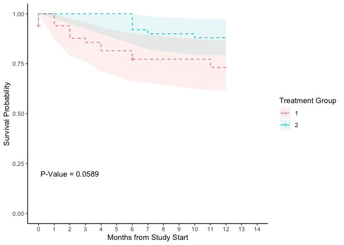

Kaplan-Meier-template
================

<http://www.sthda.com/english/wiki/survival-analysis-basics#log-rank-test-comparing-survival-curves-survdiff>

``` r
library("dplyr")
library("ggplot2")
library("survival")
library("haven")
```

1.  Simulate data

``` r
timetoevent <- haven::read_sas("/Users/siddharthapachhai/Desktop/sas/timetoevent.sas7bdat")
```

2.  Model

``` r
model <- survfit(Surv(time, cnsr) ~ treatn, data = timetoevent)
inference <- survdiff(Surv(time, cnsr) ~ treatn, data = timetoevent)
grp <- c(rep(1,model$strata[1]) , rep(2,model$strata[2]))
kp_est <- data.frame(model$time,model$surv, grp , model$lower, model$upper)
kp_est$cnsr <- 0
kp_est$cnsr[
  kp_est$model.time %in% unique(timetoevent$time[timetoevent$cnsr == 1 & 
                                                   timetoevent$treatn == 1]) & kp_est$grp == 1] <- 1
kp_est$cnsr[
  kp_est$model.time %in% unique(timetoevent$time[timetoevent$cnsr == 1 & 
                                                   timetoevent$treatn == 2]) & kp_est$grp == 2] <- 1
pvalue <- round(pchisq(inference$chisq, df=1, lower.tail=FALSE),4)
kp_est$cnsrtime <- NA
kp_est$cnsrprob <- NA
kp_est$cnsrtime[kp_est$cnsr == 1] = kp_est$model.time[kp_est$cnsr == 1]
kp_est$cnsrprob[kp_est$cnsr == 1] = kp_est$model.surv[kp_est$cnsr == 1]
kp_est <- rbind(kp_est,c(0,1,1,1,1,0))
kp_est <- rbind(kp_est,c(0,1,2,1,1,0))
kpcnsr <- kp_est %>% filter(cnsr == 1)
kp_est
```

    ##    model.time model.surv grp model.lower model.upper cnsr cnsrtime  cnsrprob
    ## 1           0  0.9400000   1   0.8764252   1.0000000    1        0 0.9400000
    ## 2           1  0.9400000   1   0.8764252   1.0000000    0       NA        NA
    ## 3           2  0.8773333   1   0.7899730   0.9743545    0       NA        NA
    ## 4           3  0.8564444   1   0.7633812   0.9608530    0       NA        NA
    ## 5           4  0.8146667   1   0.7122838   0.9317659    0       NA        NA
    ## 6           6  0.7728889   1   0.6633421   0.9005267    1        6 0.7728889
    ## 7          11  0.7311111   1   0.6161004   0.8675915    0       NA        NA
    ## 8          12  0.7311111   1   0.6161004   0.8675915    0       NA        NA
    ## 9           0  0.9600000   2   0.9071919   1.0000000    0       NA        NA
    ## 10          6  0.9200000   2   0.8477939   0.9983559    0       NA        NA
    ## 11          7  0.9000000   2   0.8205716   0.9871168    0       NA        NA
    ## 12         10  0.8800000   2   0.7943833   0.9748442    0       NA        NA
    ## 13         12  0.8800000   2   0.7943833   0.9748442    0       NA        NA
    ## 14          0  1.0000000   1   1.0000000   1.0000000    0        0 1.0000000
    ## 15          0  1.0000000   2   1.0000000   1.0000000    0        0 1.0000000

3.  Plot

``` r
ggplot()+geom_step(aes(x = model.time, y = model.surv, color = factor(grp)), data = kp_est, linetype = 2)+
  geom_ribbon(aes(x=model.time, ymin = model.lower, ymax = model.upper, fill = factor(grp)), data = kp_est , alpha = 0.1)+
  scale_x_continuous(limits = c(0, 14), breaks = c(0:14))+scale_y_continuous(limits = c(0, 1))+
  geom_point(aes(x = cnsrtime, y = cnsrprob, color = factor(grp)), data = kpcnsr, shape = 3)+
  annotate("text",x = 2,y = 0.2,label = paste0("P-Value = ",pvalue)) + xlab("Months from Study Start") + ylab("Survival Probability")+labs(fill = "Treatment Group", color = "Treatment Group") + theme_classic()
```

<!-- -->
